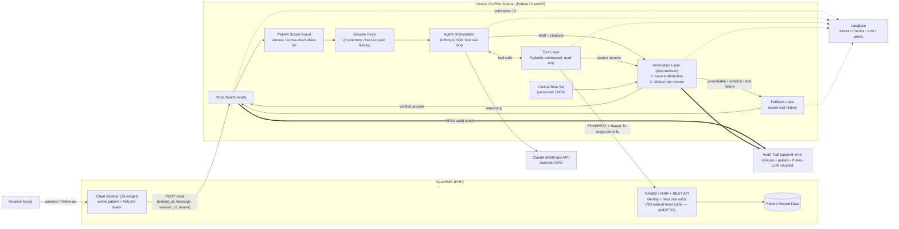

# AgentForge Clinical Co-Pilot — Architecture

## High-Level Summary

The Clinical Co-Pilot is a **read-only, multi-turn AI assistant** embedded in
OpenEMR as a chart sidebar, for one narrow user: an inpatient hospice nurse (see
[`USER.md`](USER.md)). It answers "what changed, what's the current comfort
status, what am I about to give, and what are this patient's wishes" with
**source-cited** answers — and behaves predictably when data or tools are
incomplete.

It runs as a **separate Python / FastAPI sidecar** alongside OpenEMR, not inside
the PHP monolith, so AI, observability, and evaluation tooling live in a stack
built for them (Pydantic, Langfuse, load tests). The OpenEMR sidebar is a thin
client: it holds the active patient and the signed-in user's OAuth2 token and
calls the sidecar's `/chat` endpoint.

Five decisions define the system. **(1) The LLM never speaks directly to the
nurse** — Claude proposes an answer; a deterministic verifier decides what is
shown. **(2) Authorization is layered** — the sidecar reads OpenEMR's REST/FHIR
API with the user's bearer token (OpenEMR owns identity and resource-level
access), but the audit found OpenEMR enforces *no patient-level* authorization
for a clinical-user token (AUDIT.md S1), so the sidecar itself hard-scopes every
request to the active patient. **(3) Verification is deterministic and
two-sided** — every clinical claim must map to a retrieved source record
(attribution), and answers are checked against a curated clinical rule set
(allergy / interaction / dosage). **(4) Failure shrinks scope** — on any
verification or tool failure the agent returns a clearly-labeled fallback to
recent visit history rather than inventing. **(5) Every tool has a strict
Pydantic contract**, the source of truth over the implementation.

Two tradeoffs are deliberate. **Breadth for trust:** v1 does not write to the
chart, answer general medical questions, or carry memory across patients/shifts —
those are safety decisions, not gaps. **Speed vs. completeness:** the agent
answers from a cheap patient-summary first and streams within ~1–2s, chaining
deeper retrieval only when the question needs it, targeting p95 end-to-end
< ~8–10s at the workstation.

Trust and compliance are built in from the first request. A **correlation ID**
threads the sidebar, agent, every tool call, and every LLM interaction into
**Langfuse** (metadata only — never PHI), backing the dashboards and alerts.
Separately, because OpenEMR's logs can't attribute an API read to the prompting
clinician or record the LLM disclosure (AUDIT.md C2), the sidecar emits its own
**append-only HIPAA audit trail**. Separate `/health` and `/ready` endpoints
expose liveness and real dependency checks. The result is an agent a hospital CTO
could reason about: narrow, read-only, scoped to one patient, deterministically
verified, and fully traceable.

## Key Decisions at a Glance

| Decision | Why | Cost we accept |
|----------|-----|----------------|
| FastAPI sidecar (not in-PHP) | AI/eval/observability in a fit stack; clean scaling boundary | one more service to deploy |
| Read via OpenEMR FHIR/REST + OAuth2 passthrough | reuse OpenEMR identity; standards-based, versioned | depends on FHIR coverage |
| **Sidecar-enforced patient scoping** | OpenEMR has no patient-level authz (AUDIT S1) | a small custom guard we own + test |
| Deterministic verifier (attribution + rules), not LLM-judge | defensible, testable, no verifier hallucination | curated rules aren't exhaustive |
| Multi-turn scoped to one chart session | matches the nurse's iterative follow-ups | no cross-patient/shift memory |
| Safe fallback over blank failure | stays useful under partial failure | may narrow the answer |

## System Diagram



*Langfuse holds IDs/metadata only (PHI-free); the append-only Audit Trail holds
the compliance record.*

## Components

1. **Chart Sidebar (thin client).** JS widget in the OpenEMR chart page. Captures
   the active `patient_id` + OAuth2 token, POSTs turns to `/chat`, renders
   streamed answers, citations, warnings, and the fallback label. No agent logic.
2. **FastAPI Sidecar.** Owns `POST /chat` (a conversation turn, streamed),
   `GET /health` (liveness), `GET /ready` (checks OpenEMR + Anthropic + Langfuse
   reachable; 503 if any is down).
3. **Patient Scope Guard.** The sidecar forwards the user's bearer token so
   OpenEMR enforces identity + resource-level access, then **hard-scopes every
   request and tool call to the active `patient_id`** (OpenEMR enforces no
   patient-level authz — AUDIT S1) and rejects any other patient. **Fails closed**
   on missing/expired token or unconfirmable scope.
4. **Session Store.** Conversation history keyed by `session_id` (one open chart =
   one session), **in-memory and ephemeral**; dropped when the session ends. No
   cross-patient/shift memory. (Redis is the scale-out swap, not needed for MVP.)
5. **Agent Orchestrator.** A thin Anthropic SDK tool-use loop: load session
   history → build a bounded, patient-scoped prompt → let Claude call read-only
   tools → hand the draft + cited `source_id`s to the verifier. Tools are the only
   data path. Model: Claude Sonnet-class; the verifier is **not** an LLM.
6. **Tool Layer.** Small set of read-only FHIR/REST tools, each Pydantic-contracted
   and returning structured data **with source identifiers** (see Tools &
   Contracts). Fails closed on malformed/unauthorized input.
7. **Verification Layer (deterministic).** The trust boundary — runs after the
   draft, before display (see Verification).
8. **Fallback Logic.** On verification failure, missing data, or tool error:
   return recent verified visit history, clearly labeled. Never invents; never an
   error dump.
9. **Observability.** Correlation ID minted at `/chat`, on every log line, tool
   span, and LLM call, exported to **Langfuse** — **IDs/metadata only, never PHI**
   (AUDIT R3).
10. **HIPAA Audit Trail** (separate from Langfuse). Append-only, per request:
    authenticated clinician, patient id(s), each tool/FHIR call, the
    **minimum-necessary PHI manifest sent to the LLM** (hashed/referenced), the
    model + region (proves BAA routing), verification outcome, and any fail-closed
    event. Retained ≥6y (metadata). Closes AUDIT C2.

## Request Flow (one turn)

1. Nurse asks a question or follow-up in the sidebar.
2. Sidebar `POST`s `{patient_id, message, session_id}` + bearer to `/chat`.
3. Sidecar mints a correlation ID; validates token + patient scope (**fail closed**).
4. Orchestrator loads session history; builds a bounded, patient-scoped prompt.
5. Claude calls read-only tools; tools fetch via FHIR/REST and return records + `source_id`s.
6. Claude drafts an answer with citations.
7. Verifier runs source attribution + clinical rule checks against the records.
8. **Clean** → stream the cited answer (+ any warnings); append the turn to session history.
9. **Not clean / any tool failed** → return the labeled fallback.
10. Every step traces under the one correlation ID; an audit event is emitted.

## Verification (the crux)

Two deterministic checks, after the draft and before display:

1. **Source attribution.** Each patient-specific/clinical claim must map to a
   `source_id` from the retrieved records. Unmapped claims are **withheld**;
   outside-record content is **explicitly labeled**.
2. **Clinical rule checks.** The answer (and any med it names) is checked against a
   **versioned JSON rule set**: allergy cross-check against the patient's own
   allergy list, plus a curated hospice comfort-med interaction/dosage-threshold
   table. A violation raises an explicit **warning**; an unsupported claim is
   **blocked**.

*Known limits (stated deliberately):* the v1 rule set is curated, not exhaustive;
attribution is record-level, not sentence-exact.

## Tools & Contracts

Pydantic models are the canonical contract for every tool I/O and for `/chat`.

| Tool | Returns |
|------|---------|
| `get_patient_summary(patient_id)` | Cheap orientation: demographics, active problems, recent context |
| `get_recent_encounters(patient_id)` | Recent visits / encounter metadata; backs fallback |
| `search_notes(patient_id, query)` | Relevant note excerpts with source IDs |
| `get_medications(patient_id)` | **Ordered** meds + PRN flag/interval (orders only — no administration timing; AUDIT D3) |
| `get_allergies(patient_id)` | Allergies + reactions |
| `get_labs(patient_id)` | Recent lab values + dates |
| `get_vitals(patient_id)` | Recent vitals / trends |
| `get_problem_list(patient_id)` | Active + historical problems |
| `get_goals_of_care(patient_id)` | Code status / goals of care via FHIR `Observation?category=treatment-intervention-preference` (**not** `Goal`/`Consent`; AUDIT A1) |

```python
# Tool output — every clinical record carries a source_id for attribution.
class MedicationRecord(BaseModel):
    source_id: str              # FHIR resource id — required for attribution
    name: str
    dose: str | None
    route: str | None
    is_prn: bool
    prn_interval: str | None    # e.g. "Q4H", as ordered; NO administration timing (AUDIT D3)

# API contract — the build target for the sidebar and the API collection.
class ChatRequest(BaseModel):
    patient_id: str             # Scope Guard binds every tool call to this
    message: str
    session_id: str             # one open chart = one session

class Citation(BaseModel):
    claim: str
    source_id: str
    resource_type: str          # e.g. "MedicationRequest"

class ChatResponse(BaseModel):
    answer: str
    citations: list[Citation]
    warnings: list[str]         # clinical-rule flags
    degraded: bool              # true when the fallback path was taken
    correlation_id: str
```

Bearer token travels in the `Authorization` header; `/chat` responses stream. A
**Bruno/Postman collection** covers `/chat` (happy path, cross-patient refusal,
missing-data fallback), `/health`, and `/ready` — runnable without reading source.

## Failure Modes → Behavior

| Condition | Behavior |
|-----------|----------|
| Missing patient data | Return the most complete **verified** summary available |
| Single tool fails | Skip it; retry once; fall back if the answer can't be grounded |
| Verification fails | Withhold unsupported claims; fall back |
| Clinical rule violation | Surface an explicit warning; block the offending claim |
| Unexpected model output | Discard unless verifiable |
| Unauthorized / cross-patient request | Deny and log; no answer |
| Dependency down (`/ready` red) | Sidebar shows degraded state; no silent 200s |

## Observability, Compliance & Ops

- **Dashboards (Langfuse):** request count, error rate, p50/p95 latency, tool-call
  counts, retry counts, verification pass/fail rate, token cost. *(No queue — the
  request path is synchronous.)*
- **Three alerts:** p95 latency, error rate, and tool-failure rate over threshold —
  each with a documented on-call response.
- **Health/ready:** `/health` = liveness; `/ready` = OpenEMR + Anthropic + Langfuse
  reachable.
- **PHI discipline:** minimum-necessary context to the LLM (assumed BAA); no PHI in
  Langfuse; the HIPAA audit trail (§10) is the compliance record of record.
- **Baselines + load:** capture CPU/memory/latency/throughput baselines; load-test
  at 10 and 50 concurrent users, recording p50/p95/p99 + error rate.

## Evaluation

Cases target **boundaries** (empty record, missing meds/allergies, malformed
query), **invariants** (every claim cites a source; no cross-patient leakage;
allergy-conflicting med always flagged), and **regressions**. Each documents the
failure mode it guards. Suite + results live in the eval dataset.

## Trust Boundaries (quick reference)

- OpenEMR owns identity + resource-level authz; **the sidecar owns patient-level
  scoping** (AUDIT S1).
- The sidecar only **reads** scoped data — it forwards, never elevates.
- Claude may summarize but never overrides source truth; **the verifier alone
  decides** what is displayed.
- Fallback may narrow scope but never invents content.

## Requirements Coverage (assignment)

| Requirement | Where |
|-------------|-------|
| Agentic chatbot (multi-turn, tool-invoking) | Orchestrator + Session Store |
| Verification — source attribution | Verification #1 |
| Verification — domain constraints | Verification #2 + rule set |
| Authorization / multi-user | OAuth2 (identity/resource) + **Patient Scope Guard** (AUDIT S1) |
| Speed vs. completeness | Summary-first + streaming; latency target |
| HIPAA / PHI / BAA | Audit Trail §10; min-necessary to LLM; no PHI in Langfuse |
| Failure modes / graceful degradation | Failure Modes table + Fallback |
| Observability (steps, timing, tool failures, tokens/cost) | Correlation ID + Langfuse |
| Correlation ID across boundaries | Minted at `/chat`, threaded everywhere |
| Canonical schemas | Pydantic contracts |
| Dashboards + 3 alerts | Observability, Compliance & Ops |
| /health + /ready (meaningful) | Components 2; Ops |
| Runnable API collection | Tools & Contracts |
| Baselines + load tests | Observability, Compliance & Ops |
| Eval (boundaries/invariants/regression) | Evaluation |

## MVP Build Order

1. **Sidecar skeleton** — FastAPI with `/health`, `/ready`, correlation-ID
   middleware, Langfuse wired in (PHI-redacted).
2. **Synthetic hospice data** *(prerequisite)* — demo data is empty/2017-stale
   (AUDIT D1/D2); generate current-dated patients + seed **code status** (see
   [`docker/railway/DATA_LOAD.md`](docker/railway/DATA_LOAD.md)). Nothing is
   testable without this.
3. **OpenEMR API access** — register the OAuth2 confidential client
   (authorization_code + PKCE); ship `get_patient_summary` end-to-end first.
4. **Patient Scope Guard** — enforce active-patient scoping in the request path and
   every tool call (AUDIT S1) — *before* the full tool set, so it's never bolted on.
5. **Tool layer** — the remaining read-only tools behind Pydantic contracts, each
   returning `source_id`s.
6. **Orchestrator** — Anthropic SDK tool-use loop + in-memory sessions; `POST /chat`
   streaming.
7. **Verifier + audit trail** — source attribution, then the clinical rule set
   (allergy cross-check first, then interaction/dosage); emit the HIPAA audit event
   per request.
8. **Fallback + failure paths** — wire the Failure Modes table.
9. **Sidebar widget** — inject into the chart; pass patient + token; render answer,
   citations, warnings, fallback label.
10. **Eval + load** — boundary/invariant/regression suite (incl. cross-patient
    refusal + code-status accuracy); baselines; 10 & 50-user load; dashboards +
    alerts.

## Open Items (verify on a live instance)

- Is `patient_treatment_intervention_preferences` populated in the target dataset?
  (Else run the code-status seed — build step 2.)
- Live US Core profile version via `GET /fhir/metadata` (AUDIT A5).
- Per-request read latency under load (AUDIT P2).
