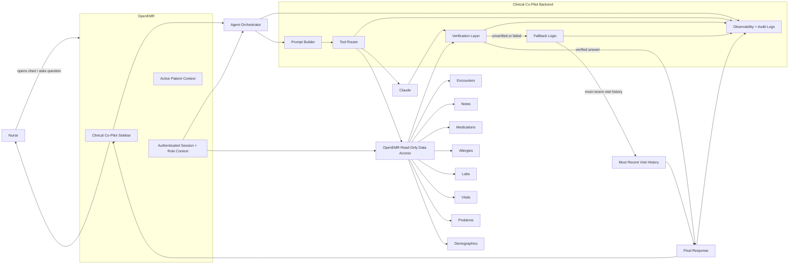

# AgentForge Clinical Co-Pilot Architecture

## High-Level Summary

AgentForge Clinical Co-Pilot is a read-only, nurse-focused assistant embedded in OpenEMR as a sidebar. The architecture is intentionally narrow: in v1 it supports a multi-turn conversation, scoped to a single patient chart session, that helps nurses quickly read and interpret patient information without leaving the chart. The system is designed around a strong trust boundary because the domain is clinical and because the brief explicitly requires that every patient-specific or clinical claim be traceable to the patient record.

The product is split into four major layers. First is the OpenEMR presentation layer, where the sidebar lives and where the current patient context is available from the existing session. Second is an agent orchestration layer that receives the nurse's question, builds a prompt with the active patient context, and routes any needed retrieval requests. Third is a verification layer that checks whether each factual claim is supported by specific source records before the response is shown. Fourth is an observability and evaluation layer that records correlation IDs, tool calls, latency, verification outcomes, and fallback behavior so the system can be audited and improved.

The most important design choice is that the model never gets to speak directly to the user. The LLM is treated as a reasoning component that proposes an answer, but the final output must be validated against source data. If the model generates an unsupported claim, the verifier blocks or rewrites it. If verification cannot be completed, or if a tool fails, the system degrades to a safe fallback: the most recent visit history for the patient, clearly labeled as fallback output rather than a complete answer. This preserves usefulness without pretending certainty.

In v1, the assistant is read-only and uses only the sample OpenEMR data that ships with the environment. That decision keeps the threat surface small while still exercising the real integration points: authenticated OpenEMR session access, patient-scoped retrieval, data-source traceability, and clinical-summary generation. The assistant's scope is limited to the data nurses actually need for chart review and information entry: demographics, encounters, notes, medications, allergies, labs, vitals, and problems. Because the user is a nurse, the assistant is optimized for reading and context-gathering rather than diagnosis, prescribing, or chart editing.

Claude is the preferred model choice for v1 because the assignment values a defensible architecture over model experimentation, and Claude is a strong fit for structured summarization and controlled tool use. The system should use strict input and output schemas for all agent tools so that retrieval, verification, and fallback logic remain deterministic and testable. Correlation IDs must travel through every request, tool call, and log event so that a single nurse interaction can be reconstructed end to end.

The overall architectural goal is simple: give a nurse a fast, traceable, clinically safe summary of a patient chart, and do it in a way that is easy to explain, easy to audit, and hard to misuse.

## System Diagram

## Core Components

### 1. OpenEMR Sidebar

The sidebar is the only user-facing entry point in v1. It keeps the nurse inside the patient chart while asking a single question and reading the answer. This avoids forcing a context switch to a separate app or dashboard.

Responsibilities:

- Display the assistant UI.
- Pass the active patient context to the backend.
- Render verified responses and fallback messages.

### 2. Session and Authorization Layer

OpenEMR remains the source of truth for authenticated user identity and patient access. The co-pilot must not invent its own authorization model. It should receive the signed-in user context and the active patient context from OpenEMR, then enforce read-only access before any retrieval step.

Responsibilities:

- Confirm the user is authenticated.
- Confirm the user can access the active patient.
- Ensure all retrieval is scoped to the current chart.

### 3. Agent Orchestrator

The orchestrator handles a multi-turn conversation scoped to one patient chart session, maintaining context across the nurse's follow-up questions. It does not carry memory across different patients or shifts. Its job is to translate each nurse question — with its prior conversational context — into a bounded workflow: build a prompt, decide whether retrieval is needed, call tools, and hand the resulting content to verification.

Responsibilities:

- Accept a single nurse query.
- Bind the query to the active patient.
- Decide what data sources to fetch.
- Call the LLM only for controlled synthesis.

### 4. Tool Router

The tool router exposes a small set of read-only retrieval tools over OpenEMR data. These tools should be strict about input and output schemas so that each call is predictable and auditable.

Primary sources:

- Demographics
- Encounters
- Notes
- Medications
- Allergies
- Labs
- Vitals
- Problems

Responsibilities:

- Perform read-only data access.
- Return structured data with source identifiers.
- Fail closed when a query is malformed or unauthorized.

### 5. Claude Reasoning Step

Claude is used to synthesize a concise answer from the structured chart data. It should not be allowed to freewheel over the entire chart without constraints. Its output is always provisional until the verifier approves it.

Responsibilities:

- Summarize retrieved chart data.
- Preserve source references.
- Avoid unsupported claims.

### 6. Verification Layer

The verifier is the most important trust boundary in the system. It checks that every factual statement in the proposed answer is tied to a source in the patient's record. It also enforces the "outside the record" rule: if the answer includes information that is not in the chart, that material must be labeled as external or out of scope.

Responsibilities:

- Map claims to source records.
- Reject unsupported patient-specific claims.
- Flag any outside-record content.
- Enforce clinical-domain constraints where possible.

### 7. Fallback Logic

If verification fails, data is missing, or a tool call breaks, the assistant returns the most recent patient visit history. This is a safety and usefulness feature, not an error dump. The fallback should be concise, clearly labeled, and better than silence.

Responsibilities:

- Detect failure in retrieval or verification.
- Return the most recent visit history.
- Preserve a clear fallback indicator for the nurse.

### 8. Observability and Audit Logging

Observability is required from the beginning, not added later. Every request gets a correlation ID, and that ID must appear in logs, tool calls, and model interactions. The system should capture request count, error count, latency, tool failures, verification pass/fail, and fallback usage.

Responsibilities:

- Emit structured logs with correlation IDs.
- Track tool latency and model latency.
- Track verification outcomes.
- Support later evaluation and audit review.

## Request Flow

1. The nurse opens a patient chart in OpenEMR.
2. The sidebar receives the active patient context.
3. The nurse submits a question (an opening question or a follow-up in the ongoing chart-session conversation).
4. The orchestrator builds a bounded prompt using the patient context and the prior turns of the current session.
5. The tool router fetches the relevant record data.
6. Claude synthesizes a draft answer from the retrieved data.
7. The verifier checks every claim against source records.
8. If the answer is fully supported, it is returned to the sidebar.
9. If verification fails or a tool fails, fallback logic returns the most recent visit history.
10. The entire interaction is logged under one correlation ID.

## Trust Boundaries

- OpenEMR owns identity, session state, and patient access.
- The agent backend may only read scoped patient data.
- Claude may summarize data but may not override source truth.
- The verifier decides whether a claim is displayable.
- Fallback logic is allowed to reduce scope, but not invent content.

## Data and Source of Truth

The system should treat OpenEMR as the source of truth for patient data. The assistant should not cache clinical facts in a separate store in v1 unless that cache is clearly treated as a transient performance layer. Any cached output must preserve source references and remain scoped to the current patient.

## Failure Modes and Expected Behavior

- Missing patient data: return the most complete verified summary available.
- Tool failure: skip the broken tool and fall back to recent visit history if needed.
- Verification failure: suppress unsupported claims and fall back.
- Unexpected model output: discard the output unless it can be verified.
- Unauthorized access attempt: deny access and log the event.

## Observability, Evaluation, and Quality Gates

The architecture supports the required sprint deliverables by design:

- Correlation IDs for every request.
- Structured schemas for tool I/O.
- Health and readiness checks.
- Dashboard metrics for latency, errors, tool failures, and verification rate.
- Evaluation cases focused on boundaries, invariants, and regressions.

This is important because the project is judged on trustworthiness and defensibility, not just demo polish.

## Tradeoffs

- Session-scoped multi-turn over cross-session memory: supports the nurse's natural follow-up questions while keeping every conversation bounded to one patient and independently verifiable.
- Sidebar over dashboard: better workflow fit for chart review.
- Read-only over write access: lower risk and easier to defend.
- Claude over model experimentation: a defensible, production-oriented starting point.
- Fallback history over blank failure: preserves utility under partial failure.

## Open Questions

- Which exact sidebar placement is best inside the existing OpenEMR UI?
- Should the fallback include a brief warning line or only a silent degradation label?
- Which source types should carry the highest verification priority when claims conflict?
- Which retrieval tools are essential in v1 versus safe to defer?

## Conclusion

This architecture is built to satisfy the brief's core constraint: a clinical AI agent must be useful without being casual about truth. The system is intentionally narrow, read-only, and heavily verified so it can support nurses during chart review while remaining auditable and safe enough to justify its place inside a healthcare workflow.
